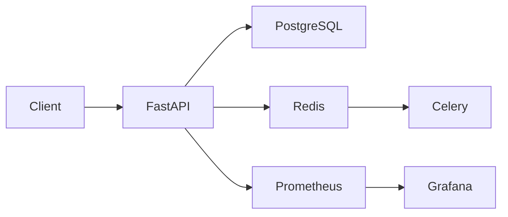

# KRONOS – Cloud-Native Anomaly Detection Platform


## Overview

KRONOS is a cloud-native anomaly detection platform built with FastAPI. It analyzes time-series data using statistical techniques and exposes a secure REST API using JWT authentication. The project demonstrates production-oriented backend engineering practices including asynchronous database access, Docker, Kubernetes, monitoring, and CI/CD.

## Key Features

- FastAPI REST API
- JWT Authentication
- User registration and login
- Time-series anomaly detection
- Detection history
- File upload endpoint
- Background processing with Celery and Redis
- Async PostgreSQL using SQLAlchemy
- Alembic database migrations
- Docker & Docker Compose
- Kubernetes manifests
- Prometheus metrics
- Grafana dashboards
- GitHub Actions CI/CD
- Automated testing with Pytest

## Detection Algorithms

Implemented algorithms:

- Z-Score
- Interquartile Range (IQR)
- Moving Average
- Combined anomaly voting

## Technology Stack

| Layer | Technology |
|---|---|
| Backend | FastAPI |
| Language | Python 3.11 |
| Database | PostgreSQL |
| ORM | SQLAlchemy (Async) |
| Validation | Pydantic |
| Authentication | JWT |
| Background Jobs | Celery + Redis |
| Migrations | Alembic |
| Monitoring | Prometheus + Grafana |
| Containerization | Docker |
| Orchestration | Kubernetes |
| CI/CD | GitHub Actions |

## Repository Structure

```text
anomaly-detection/
├── app/
├── alembic/
├── k8s/
├── monitoring/
├── tests/
├── .github/workflows/
├── Dockerfile
├── docker-compose.yml
├── requirements.txt
└── README.md
```

## Architecture



## Environment Variables

See `.env.example`.

Required variables:

```env
DATABASE_URL=
SECRET_KEY=
DEBUG=
REDIS_URL=
CELERY_BROKER_URL=
CELERY_RESULT_BACKEND=
ACCESS_TOKEN_EXPIRE_MINUTES=
```

## Local Development

```bash
python -m venv .venv
pip install -r requirements.txt
uvicorn app.main:app --reload
```

Swagger UI:

```
http://localhost:8000/docs
```

## Docker

```bash
docker compose up --build
```

## Kubernetes

```bash
kubectl apply -k k8s/base
```

## API Endpoints

- GET /
- GET /health
- GET /ready
- GET /metrics
- POST /auth/register
- POST /auth/login
- POST /detect/

Example request:

```json
{
  "column_name": "value",
  "values": [10,12,13,11,10,12,11,13,14,100]
}
```

## Monitoring

- Prometheus metrics endpoint
- Grafana dashboards
- Request latency metrics
- Request counters
- Error metrics

## CI/CD

GitHub Actions performs:

- Dependency installation
- Python syntax validation
- Import validation
- Docker image build
- Container image publishing

## Testing

Current test coverage includes:

- Configuration tests
- Detector service tests
- Root endpoint tests
- Health endpoint tests

Run tests:

```bash
pytest -v
```

Coverage:

```bash
pytest --cov=app --cov-report=term
```

## Security

- JWT authentication
- Password hashing
- Protected endpoints
- Environment-based configuration

## Production-Oriented Features

- Async FastAPI architecture
- Dockerized deployment
- Kubernetes manifests
- Health and readiness endpoints
- Prometheus metrics
- Centralized configuration
- Logging
- Alembic migrations
- GitHub Actions CI/CD

## Future Improvements

- Increase automated test coverage
- Additional anomaly detection algorithms
- Enhanced authorization
- Performance optimization

## License

This project is licensed under the **MIT License**.

> Add an `LICENSE` file containing the MIT License text before making the repository public.

## Author

**kadali.siri**

Cloud-Native Backend Engineering Portfolio Project
